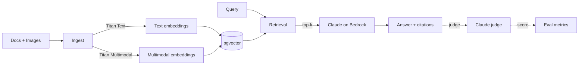

# bedrock-multimodal-rag

[](https://github.com/sarteta/bedrock-multimodal-rag/actions/workflows/docker.yml)
[](https://www.python.org)
[](https://aws.amazon.com/bedrock/)
[](https://github.com/pgvector/pgvector)
[](./LICENSE)

RAG on AWS Bedrock that handles text and images, with hybrid retrieval and an evaluator that tells you whether changes helped or hurt.



## Quick start

```bash
pip install -e .
cp .env.example .env   # AWS creds + Postgres URL
python -m bedrock_rag.ingest path/to/docs/
python -m bedrock_rag.cli query "what does the policy say"
```

Requires Bedrock model access (Claude Sonnet, Titan Text v2, Titan Multimodal v1) and PostgreSQL with the pgvector extension.

## Pieces

`bedrock_client.py`
   Adapter over boto3. Uses the Converse API for generation, since it normalizes the request shape across model providers, and `invoke_model` only for embeddings (which Converse does not cover).

`embeddings.py`
   Titan Text v2 for text-only docs, Titan Multimodal v1 when images are involved. Both go into the same 1024-dim vector space.

`retrieval.py`
   `pure_semantic` is cosine over dense embeddings. Cheap, fast, baseline. `hybrid` is BM25 plus dense, fused with reciprocal rank fusion, optionally cross-encoder reranked. Roughly 2x cost per query but Recall@10 is 30 to 40 percent better on the eval sets I ran.

`eval.py`
   Recall@k and MRR for retrieval. Claude as judge for generation faithfulness. Run after every retrieval change to know if you helped.

## Tests

```
pytest
```

31 tests with mocked Bedrock and a Postgres test container started by the suite (skipped with a warning if Docker is not running).

## Cost

A typical RAG query is around $0.005 to $0.007: one text embedding, one multimodal embedding if image input, one Sonnet generation, one pgvector lookup. The pgvector lookup is essentially free at any scale that fits a single Postgres host.

The reason to pick Bedrock over the OpenAI stack is the BAA story, IAM-scoped permissions, and AWS data residency. Quality is comparable.

## License

MIT
