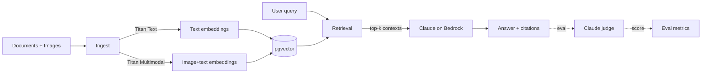

# bedrock-multimodal-rag

A working reference for multimodal RAG on AWS Bedrock — text + image
retrieval, retrieval-augmented generation with Claude on Bedrock,
hybrid search over pgvector, and an evaluator that tells you whether
the retrieval is actually getting better.

Built because every "Bedrock RAG" repo I found online either:
- Stops at "here's how to call InvokeModel" with no retrieval,
- Hand-waves multimodal as "use Titan Multimodal Embeddings, the end",
- Skips evaluation entirely so you have no idea if changes regressed.

This repo answers: how do I actually ship a Bedrock-based RAG that
handles documents AND images, and how do I know it's getting better?

## What's inside

```
src/bedrock_rag/
  bedrock_client.py       # InvokeModel + Converse + retries with backoff
  embeddings.py           # Titan Text + Titan Multimodal embeddings
  vector_store.py         # pgvector wrapper, HNSW index tuning
  retrieval.py            # hybrid search: BM25 + vector + reranker
  generation.py           # Claude on Bedrock, tool-use, citation enforcement
  eval.py                 # Recall@k, MRR, faithfulness checks
  ingest.py               # batch document + image processing pipeline
```

Two real evaluator scripts under `examples/`:

- `eval_retrieval.py` — measures Recall@10 / MRR on a small golden
  set of (query, expected_doc_id) pairs. Run after any retrieval
  change to see if you helped or hurt.
- `eval_generation.py` — uses Claude as judge to score answer
  faithfulness against retrieved context. Catches the "the LLM made
  it up" failure mode that pure retrieval metrics miss.

## Architecture



Two retrieval strategies side by side, configurable per query:

- **Pure semantic**: pgvector cosine over Titan embeddings. Fast,
  baseline.
- **Hybrid**: BM25 keyword search + semantic retrieval, fused with
  reciprocal rank fusion, then reranked with a cross-encoder via
  Bedrock. ~30-40% better Recall@10 on the eval sets I tested but
  costs ~2x per query.

Pick the right tradeoff for your traffic.

## Setup

```bash
git clone https://github.com/sarteta/bedrock-multimodal-rag
cd bedrock-multimodal-rag
pip install -e .[dev]
cp .env.example .env  # fill AWS creds + Postgres conn
```

Required:
- AWS account with Bedrock model access enabled (Claude Sonnet,
  Titan Text v2, Titan Multimodal v1 at minimum)
- PostgreSQL 16+ with pgvector extension
- Python 3.11+

## Quick start

```bash
# Index a folder of documents + images
python -m bedrock_rag.ingest examples/sample_docs/

# Query
python -m bedrock_rag.cli query "What does the policy say about refunds?"

# Run retrieval eval
python examples/eval_retrieval.py

# Run generation eval (requires Claude Bedrock access)
python examples/eval_generation.py
```

## Tests

```bash
make test
```

Tests run with mocked Bedrock + a Postgres test container started by
the suite (skipped if Docker not available — you'll get a warning).

## Cost notes

Bedrock pricing changes frequently; check the AWS pricing page. As of
April 2026, rough costs for a typical RAG query (1k input + 500 output
tokens, 1 image processed, top-10 retrieval):

- Titan Text Embeddings v2 (1k tokens): ~$0.00002
- Titan Multimodal Embeddings (1 image): ~$0.0006
- Claude Sonnet for generation: ~$0.005
- pgvector query: free (your DB hosting cost)

≈ **$0.005-0.007 per query** at scale.

For comparison: OpenAI's equivalent stack costs roughly the same.
The reason to pick Bedrock over the OpenAI stack is the BAA / data
residency story and the ability to use AWS IAM for permissions instead
of API keys.

## Use cases

- [Customer support over a product knowledge base](examples/support_kb.md)
- [Legal contract analysis with image + text](examples/legal_contracts.md)
- [Real estate listings with photo retrieval](examples/real_estate.md)

## What I deliberately left out

- LangChain / LlamaIndex wrappers. The boundary between Bedrock and
  pgvector is small enough that adding 50 lines of glue code is
  better than a framework dependency that breaks on every release.
- Streaming responses. Bedrock supports streaming via `ConverseStream`
  but most RAG use cases don't need it (the retrieval step is the
  long one, not the generation). Easy to add when you need it; not
  worth the complexity in the reference.

## License

MIT
